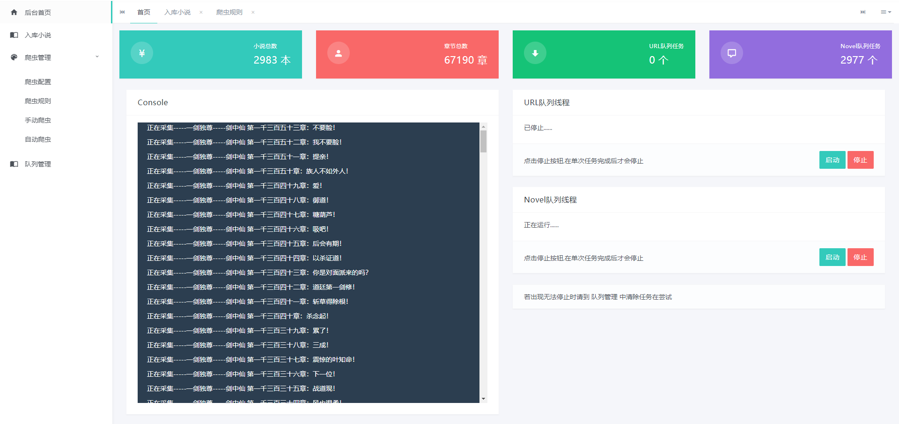

# novel

#### 介绍
使用java语言进行开发，对于每一个小说网站，提取出小说共同属性如作者、名称、章节等。编写规则进行测试，目前已适配	www.xbiquge.la/ 、 	www.b520.cc/ 
该项目只有后台系统，只是将数据采集到数据库内，没有进行数据渲染等功能。可以自行开发api 适配 PC 或 小程序 等应用

#### 项目环境
JDK 1.8
MYSQL 5.7
Maven 3.8

#### 使用技术
SpringBoot 2.5
kaptcha 2.3
httpclient 4.5
jsoup 1.13
websocket 2.5
mybatis 2.2
前端使用 光年后台管理系统 模板

#### 安装教程

1.  下载项目到本地
2.  创建数据库 novel，并将项目中novel.sql文件导入(已添加规则，默认登录账号密码admin 、 333666)
3.  使用idea打开项目配置好maven拉去依赖

#### 配置信息
    application.properties
1.  修改sql的数据库和密码
2.  修改 application.properties 配置文件中信息
3.  covePath 小说封面下载保存路径
4.  webSocketUrl socket连接地址(需要填写服务器端的地址，如果部署在服务器的话不可以使用localhost等地址，这样的话自己和自己能连接个鬼)

#### 项目截图

#### 特技

1.  使用 Readme\_XXX.md 来支持不同的语言，例如 Readme\_en.md, Readme\_zh.md
2.  Gitee 官方博客 [blog.gitee.com](https://blog.gitee.com)
3.  你可以 [https://gitee.com/explore](https://gitee.com/explore) 这个地址来了解 Gitee 上的优秀开源项目
4.  [GVP](https://gitee.com/gvp) 全称是 Gitee 最有价值开源项目，是综合评定出的优秀开源项目
5.  Gitee 官方提供的使用手册 [https://gitee.com/help](https://gitee.com/help)
6.  Gitee 封面人物是一档用来展示 Gitee 会员风采的栏目 [https://gitee.com/gitee-stars/](https://gitee.com/gitee-stars/)
